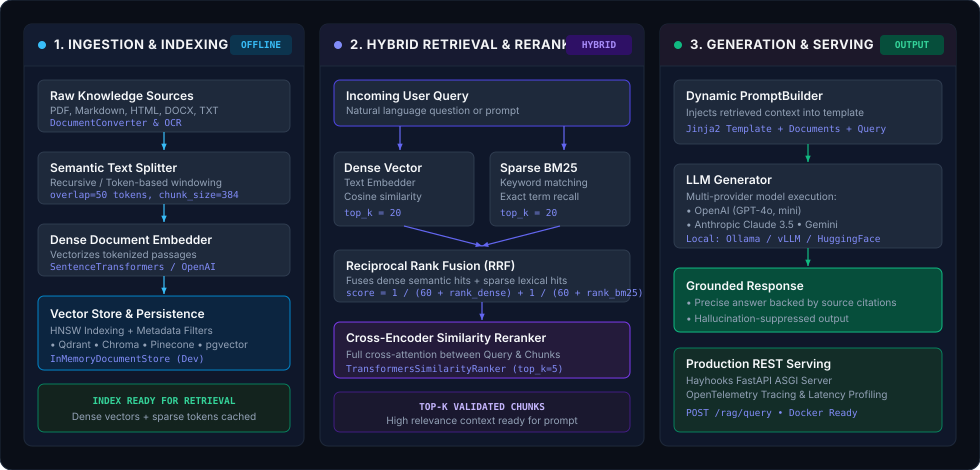

<p align="center">
  
</p>

<h1 align="center">⚡ Aura — High-Performance RAG Pipeline Architecture</h1>

<p align="center">
  <strong>A modular Python framework engineered for high-precision Retrieval-Augmented Generation (RAG) pipelines, hybrid vector search, and grounded LLM orchestration.</strong>
</p>

<p align="center">
  <a href="https://www.python.org"></a>
  <a href="https://pytorch.org"></a>
  <a href="https://fastapi.tiangolo.com"></a>
  <a href="https://opentelemetry.io"></a>
  <a href="https://github.com/SHAZAAN25/Aura/blob/main/LICENSE"></a>
</p>

<p align="center">
  <em>"Ground every generation in validated context. Connect document stores, hybrid retrievers, and cross-encoders into deterministic RAG pipelines."</em>
</p>

---

## 👨‍💼 Leadership & Credits

> **Project Architected and Maintained by [Mohammed Shazaan Aarish](https://github.com/SHAZAAN25)**  
> *Engineered to deliver modular, transparent, and scalable Retrieval-Augmented Generation (RAG) pipelines with multi-provider LLM support, hybrid search, and production observability.*

---

## ⚡ Core Engineering Philosophy

Most naive RAG implementations fail in production because they rely on simple top-k semantic vector similarity alone. When domain queries contain exact product SKUs, specific acronyms, or complex nuances, single-embedding retrievers return irrelevant chunks, leading directly to hallucinations.

**Aura addresses this through a three-stage RAG architecture:**

1. **Multi-Modal Document Ingestion & Chunking**: Raw files (PDFs, DOCX, Markdown, HTML) are normalized, cleaned, and split using semantic token-window algorithms with deliberate overlap to preserve sentence boundaries.
2. **Hybrid Retrieval (Dense + Sparse Fusion)**: Queries are routed simultaneously through dense vector embeddings (cosine semantic matching) and sparse BM25 indexers (exact keyword matching), merged via Reciprocal Rank Fusion (RRF).
3. **Cross-Encoder Context Reranking**: Candidate passages are scored against the query using deep cross-attention before hitting the prompt builder, ensuring only high-signal passages consume context window tokens.
4. **Context-Grounded Generation**: Dynamic prompt templates strictly bound the LLM to provide cited answers based solely on verified context passages.
5. **Declarative Pipeline Serialization & Tracing**: Every RAG pipeline can be exported to version-controlled YAML and deployed as an ASGI microservice with native OpenTelemetry tracing out of the box.

---

## 🏛️ System Architecture

<p align="center">
  
</p>

---

## 🌟 Key Capabilities

### 🔍 Hybrid Retrieval & Reranking
- **Dense Semantic Embeddings**: First-class support for `SentenceTransformers`, `OpenAI`, `Cohere`, and Hugging Face embedding endpoints.
- **Sparse BM25 Keyword Search**: In-memory and distributed BM25 indexers for exact terminology recall.
- **Cross-Encoder Rerankers**: Integrated `TransformersSimilarityRanker` and Cohere Rerank API to filter candidate pools down to the most relevant top-$k$ passages.

### 🗄️ Vector Database Adapters
- Pluggable document stores with zero pipeline rewrites:
  - **Qdrant**, **Pinecone**, **Chroma**, **OpenSearch**, **pgvector (PostgreSQL)**, and **Milvus**.
  - Built-in `InMemoryDocumentStore` for instant local prototyping and unit testing.

### 📄 Document Parsers & Preprocessing
- Native file converters: **PDF** (PyPDF, PDFMiner, Azure Form Recognizer OCR), **DOCX**, **PPTX**, **Markdown**, and **HTML** (Trafilatura).
- Granular chunking: Recursive token-aware, sentence-boundary, and character splitters.

### 🤖 Multi-Provider LLM Generation
- Seamless integration with **OpenAI** (GPT-4o, GPT-4o-mini), **Anthropic Claude 3.5**, **Google Gemini**, and local self-hosted inference engines via **Ollama**, **vLLM**, and **Hugging Face Transformers**.
- Streaming completion support and structured JSON Schema validation.

### 🚀 Production Serving via Hayhooks
- One-command deployment of any Aura RAG pipeline as a **FastAPI** REST microservice.
- Native **OpenTelemetry** instrumentation tracking retrieval latency, token usage, and end-to-end trace waterfalls.

---

## ⚙️ Component Matrix

| Stage | Component | Supported Technologies | Primary Role |
| :--- | :--- | :--- | :--- |
| **Ingestion** | `DocumentConverter` | PyPDF, Trafilatura, python-docx, OCR | Extracts raw text and metadata from files |
| **Ingestion** | `DocumentSplitter` | Recursive, NLTK, Tiktoken | Chunks long texts with configurable token overlap |
| **Ingestion** | `DocumentEmbedder` | SentenceTransformers, OpenAI, Cohere | Generates dense vectors for document chunks |
| **Storage** | `DocumentStore` | Qdrant, Chroma, Pinecone, pgvector, InMemory | Persists vectors and metadata for fast retrieval |
| **Retrieval** | `EmbeddingRetriever` | Dense Vector Cosine Similarity | Retrieves semantically similar chunks |
| **Retrieval** | `BM25Retriever` | Sparse Inverted Index | Retrieves exact keyword matches |
| **Reranking** | `SimilarityRanker` | Cross-Encoders, Cohere Rerank | Re-scores candidate passages against the query |
| **Prompting** | `PromptBuilder` | Jinja2 Templating Engine | Injects retrieved context into prompt safely |
| **Generation** | `OpenAIGenerator` | GPT-4o, Claude, Gemini, Ollama, vLLM | Produces grounded answers backed by source facts |

---

## 📂 Repository Structure

```
Aura/
├── haystack/                    # Core Aura Engine Framework
│   ├── components/              # Modular RAG Components
│   │   ├── builders/            # Dynamic PromptBuilder & Jinja2 templates
│   │   ├── converters/          # PyPDF, DOCX, HTML, Markdown, OCR parsers
│   │   ├── embedders/           # Text & Document dense vector embedders
│   │   ├── generators/          # LLM interfaces (OpenAI, Claude, Gemini, Ollama)
│   │   ├── rankers/             # Cross-Encoder similarity rankers
│   │   ├── retrievers/          # Dense embedding & sparse BM25 retrievers
│   │   ├── routers/             # Conditional branching & language routers
│   │   └── splitters/           # Recursive token & sentence text splitters
│   ├── core/                    # Pipeline Engine & Declarative Serialization
│   │   ├── pipeline/            # Graph execution & socket type validation
│   │   └── serialization/       # YAML / JSON pipeline export & import
│   ├── dataclasses/             # Document, ChatMessage, Tool, ByteStream
│   └── tracing/                 # OpenTelemetry and Datadog tracing hooks
├── docs/                        # Architecture diagrams & documentation
│   └── img/                     # Static SVG architecture & logos
├── examples/                    # End-to-end RAG recipes & tutorials
├── test/                        # Unit, integration, and e2e test suites
├── pyproject.toml               # Build system, dependencies, and metadata
├── CITATION.cff                 # Citation metadata
├── CONTRIBUTING.md              # Contribution standards
├── LICENSE                      # Apache License 2.0
└── README.md                    # Project documentation
```

---

## 🚀 Quickstart

### Prerequisites
- Python 3.9, 3.10, 3.11, or 3.12
- `pip` or [`uv`](https://github.com/astral-sh/uv)

### 1. Installation

Install the package directly:
```bash
pip install haystack-ai
```

Or clone and install in editable mode:
```bash
git clone https://github.com/SHAZAAN25/Aura.git
cd Aura
pip install -e ".[test]"
```

### 2. Building a Production RAG Pipeline

Here is a complete, working example illustrating how to index documents and query them using an end-to-end RAG pipeline:

```python
from haystack import Pipeline, Document
from haystack.document_stores.in_memory import InMemoryDocumentStore
from haystack.components.embedders import OpenAITextEmbedder, OpenAIDocumentEmbedder
from haystack.components.retrievers.in_memory import InMemoryEmbeddingRetriever
from haystack.components.builders import PromptBuilder
from haystack.components.generators import OpenAIGenerator

# 1. Initialize Document Store
document_store = InMemoryDocumentStore()

# 2. Ingest & Embed Knowledge Passages
passages = [
    Document(content="Aura is a high-performance RAG pipeline framework architected by Mohammed Shazaan Aarish."),
    Document(
        content="Aura solves retrieval precision issues by combining dense vector search, BM25, and cross-encoder reranking."
    ),
    Document(
        content="Aura supports plug-and-play LLM providers including OpenAI, Anthropic, Gemini, and local Ollama/vLLM instances."
    ),
]

doc_embedder = OpenAIDocumentEmbedder(model="text-embedding-3-small")
indexed_docs = doc_embedder.run(documents=passages)["documents"]
document_store.write_documents(indexed_docs)

# 3. Assemble the RAG Pipeline
rag_pipeline = Pipeline()
rag_pipeline.add_component("text_embedder", OpenAITextEmbedder(model="text-embedding-3-small"))
rag_pipeline.add_component("retriever", InMemoryEmbeddingRetriever(document_store=document_store, top_k=2))

prompt_template = """
You are a precise technical assistant. Answer the user's question using ONLY the provided context passages.
If the answer is not contained in the context, state that clearly.

Context:

  - {{ doc.content }}


Question: {{ query }}
Answer:
"""
rag_pipeline.add_component("prompt_builder", PromptBuilder(template=prompt_template))
rag_pipeline.add_component("llm", OpenAIGenerator(model="gpt-4o-mini"))

# 4. Connect the Pipeline Components
rag_pipeline.connect("text_embedder.embedding", "retriever.query_embedding")
rag_pipeline.connect("retriever.documents", "prompt_builder.documents")
rag_pipeline.connect("prompt_builder.prompt", "llm.prompt")

# 5. Execute the RAG Query
query = "What is Aura and how does it improve retrieval precision?"
result = rag_pipeline.run({"text_embedder": {"text": query}, "prompt_builder": {"query": query}})

print("⚡ Grounded Answer:\n", result["llm"]["replies"][0])
```

### 3. Export Pipeline to Declarative YAML

Pipelines can be saved as declarative YAML files for versioning and containerized deployments:

```python
# Export pipeline to YAML string
yaml_repr = rag_pipeline.dumps()

with open("rag_pipeline.yaml", "w") as f:
    f.write(yaml_repr)

# Reload pipeline on another server without recreating code
loaded_pipeline = Pipeline.loads(yaml_repr)
```

---

## 🧪 Testing & Verification

```bash
# Run Core Pipeline Unit Tests
pytest test/core/pipeline/

# Run Component Tests
pytest test/components/

# Verify Types with Mypy
mypy haystack

# Run Static Analysis & Formatting Checks
ruff check .
ruff format --check .
```

---

## 🤝 Contributing

Contributions are welcome! Please follow these steps:

1. **Fork the Repository**: `https://github.com/SHAZAAN25/Aura`
2. **Create a Feature Branch**: `git checkout -b feature/new-rag-component`
3. **Commit Your Changes**: Follow conventional commits (`feat: add qdrant hybrid retriever`)
4. **Push & Open a Pull Request**: Provide a clear explanation of your changes and test coverage

For detailed guidelines, see [CONTRIBUTING.md](CONTRIBUTING.md).

---

## 📜 License & Attribution

- Distributed under the **Apache License 2.0**. See [`LICENSE`](LICENSE) for details.
- Built with respect for foundational open-source components and the broader Python AI community.

---

<p align="center">
  <b>⚡ Aura — High-Performance RAG Pipeline Architecture</b><br>
  Architected & Maintained with precision by <b><a href="https://github.com/SHAZAAN25">Mohammed Shazaan Aarish</a></b>
</p>
